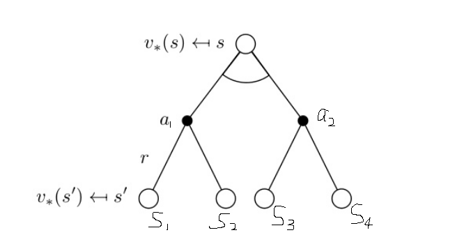

### 符号

**注意:** 在写这段文字的时候, 我理解的 ***未来奖励*** = ***收益*** = ***累积回报***.

**Policy(策略)**

用来知道agent如何采取行动

* A policy is the agent's behaviour.

* It is a map from state to action, e.g.

* Deterministic policy: $$a=\pi(s)$$ 

* Stochastic policy: $$\pi (a|s) = p[A_{t}=a|S_{t}=s]$$ 

  ​      

**Value Function(值函数)**

用来评价状态的好坏

* Value function is a prediction of future reward
* Used to evaluate the goodness/badness of **states**
* And therefore to select between actions, e.g.

$$V_{\pi}(s)=\mathbb E_{\pi}[R_{t+1}+\gamma R_{t+2}+\gamma^{2}r_{t+3}+...|S_{t}=s]$$  

**bellman equation(贝尔曼方程)**

由

$$V_{\pi}(s)=\mathbb E_{\pi}[R_{t+1}+\gamma R_{t+2}+\gamma^{2}r_{t+3}+...|S_{t}=s]$$  

推导

$$V_{\pi}(s)=\mathbb E_{\pi}[R_{t+1}+\gamma V(s_{t+1}) | S_{t}=s]$$ 

**Model(模型)**

* A model predicts what the environment will do next 
* P predicts the next state
* R predicts the next (immediate) reward, e.g.

**Action value function(动作值函数)**

用来评价在指定状态下采取各种动作的好坏, 只是在状态s执行特定动作a的好坏**((**后续步骤服从$$\pi(s)$$,

是不确定的**))**.

Used to evaluate the goodness/badness of **actions** 

$$Q_{\pi}(s,a)=r_{s,a} + \gamma\sum_{s_{i}}  p_{a,s \rightarrow s_{i}}V(s_{i}) $$  

也可以写成

$$Q_{\pi}(s,a)=\sum_{s_{i}} p_{a,s \rightarrow s_{i}}(r_{s,a} + \gamma V(s_{i})) $$  

这两种写法可以参考下图理解:

* 第一种写法, 执行动作$$a$$, 即刻获得立即奖励$$r_{s,a}$$ , 再加上后续的未来奖励(**long-term reward**).

* 第二种写法, 认为$$Q_{\pi}(s,a)$$ 是 所有可能到达状态通路的奖励之和, 即通路1的收益

   X 通路1的概率 + 通路2的收益 X 通路2的概率 + ...

**Bellman update(值函数迭代)**

$$V_{s} \leftarrow \max_{a} \sum_{s_{i}}p_{a, s \to s_{i}}(r_{s,a}+\gamma V_{s_{i}}) $$   

跟新值函数后, 会影响动作值函数,即:$$Q(S,a)$$ 又名action value, 从而影响动作的选择,

即,改变了策略Policy.

如上图所示, 假设当前状态在$$S$$, 可以选择的动作有两个,设为$$a_{1}$$, $$a_{2}$$ .

假设通过$$a_1$$, $$a_2$$, 可以到达的状态有四个, 分别记为 $$S_1$$,  $$S_2$$,  $$S_3$$,  $$S_4$$.

假设  $$S_1$$,  $$S_2$$,  $$S_3$$,  $$S_4$$ 四个状态的值函数已知, 分别为 $$V_1$$,  $$V_2$$,  $$V_3$$,  $$V_4$$.

根据 **行为值函数的定义** , 

对于动作 $$a_1$$: 

$$Q_{\pi}(s, a_1)=r_{s, a_1} + \gamma\sum_{s_{i}}  p_{a_1,s \rightarrow s_{i}}V(s^{i}) $$ 

对于动作 $$a_2$$ : 

$$Q_{\pi}(s, a_2)=r_{s, a_2} + \gamma\sum_{s_{i}}  p_{a_2,s \rightarrow s_{i}}V(s^{i}) $$ 

那么 $$Q_{\pi}(s, a_1)$$  , $$Q_{\pi}(s, a_2)$$ 这个两值可以用来评价在状态$$S$$ , 执行动作$$a_1$$, $$a_2$$ 的好坏, 越大就  

表示动作越好, 意味着将来的累积回报越大.

**Contracting mapping(压缩映射)**

**定义1**: 设$$X$$ 是度量空间,其度量用$$\rho$$表示.映射$$T: X \rightarrow X$$,若存在$$a$$, $$0 \leq a \lt 1$$,使得$$\rho(Tx,Ty) \le a\rho(x,y)$$,$$\forall x,y \in X$$, 则称$$T$$是$$X$$上的一个压缩映射.

若存在$$x_{0}\in X$$使得$$Tx_{0}=x_{0}$$,则称$$x_{0}$$是$$T$$的不动点.

**定理1**:完备度量空间上的压缩映射具有唯一的不动点.

定理1是说,从度量空间任意一点出发,只要满足压缩映射,压缩映射的序列必定会收敛到唯一的不动点.因此证明一个迭代序列是不是收敛,只要证明该序列所对应的映射是不是压缩映射.

从当前值函数到下一个迭代值函数的映射可表示为

$$T^{\pi}(v)=R^{\pi}+\gamma P^{\pi}v, 0 \le \gamma \lt 1$$
$$
\begin{align}
\rho(T^{\pi}(u),T^{\pi}(v)) =&  \|T^{\pi}(u)-T^{\pi}(v)\|_{\infty} \\
=&  \|(R^{\pi}+ \gamma P^{\pi}u)-(R^{\pi}+\gamma P^{\pi}v)\|_{\infty} \\
=&  \|\gamma P^{\pi}(u-v)\|_{\infty} \\
\le&  \|\gamma P^{\pi}\|u-v\|_{\infty}\|_{\infty} \\
\le&  \gamma \|u-v\|_{\infty}
\end{align}
$$
根据定义1,在给定的$$\pi$$下,该序列会收敛.(这里的收敛是指**策略评估**会收敛).

***

* **1.为什么要写成$$Q_{\pi}(s, a_1)$$  而不是 $$Q(s, a_1)$$ 呢? **

**答:** 

$$p_{a_1,s \rightarrow s_{i}}$$ 这一项是在策略 $$\pi$$ 下的产物, 虽然策略 $$\pi$$ 不能决定 $$p_{a_1,s \rightarrow s_{i}}$$, 但是有参与. 

因为 $$p_{a_1,s \rightarrow s_{i}} = p(a_1 | s) * p(s_{i}|a_1) $$    

第一部分由策略$$\pi$$ 决定, 后一项 $$p(s_{i}|a_1)$$  即(执行动作$$a_1$$后, 到达状态$$s_i$$的概率), 是由环境ENV  

决定的.

***

* **2.Q 和 V 之间的关系是什么?**

**答:**

根据定义: $$V_{\pi}(S)$$表示在给定测略$$\pi$$下, agent在状态S处的累积回报的期望, 则:

$$V_{\pi}(S)=\sum_{a \in A} \pi(a|s)Q_{\pi}(s,a) $$  

以上图为例, 则$$A=\{ a_1, a_2 \} $$.  

$$V_{\pi}(S) = \sum_{s_{i}}p_{a, s \to s_{i}}(r_{s,a}+\gamma V_{s_{i}}) $$    

***

- **3.什么是最优状态值函数?**

 **每个策略都对应着一个状态函数,最优策略自然对应着最优状态值函数.**

定义: 最优状态值函数$$V^*(s)=\max_{\pi}V_{\pi}(s)$$, 最优状态行为值函数$$Q^*(s,a)$$,为在所有策略中最大的

状态行为值函数, 即:

$$Q^*(s,a)=\max_{\pi}Q_{\pi}(s,a)$$ 

最优状态值函数的贝尔曼方程:

$$V^*(s)=\max_{a}[r_{s,a} + \gamma \sum_{s_{i} \in S }p_{a, s \rightarrow s_{i}}V^*(s_{i})]$$  

***

* **4.为什么更新值函数的公式为$$V_{s} \leftarrow \max_{a} \sum_{s_{i}}p_{a, s \to s_{i}}(r_{s,a}+\gamma V_{s_{i}}) $$ ?**

**答:** 

假设我们的初始状态为$$S_{0}$$, 那么我们的目的是: 通过调整策略$$\pi$$(调整策略,最终会体现在动作$$a$$的选择上), 

使得$$V_{0}$$能够最大,即使得状态$$S_{0}$$的累积回报最大. 即:

$$V_{S_{0}}=\max_{a \in A} \mathbb E_{s \sim S}[r_{s,a} + \gamma V_{s}]=\max_{a \in A}[\sum p_{a,s_0 \rightarrow s}(r_{s,a}+\gamma V_{s})]$$ 

其中$$S$$ 为 $$S_0$$ 的后继状态.

上式最右边可以看成是两个阶段,

* 第一个阶段是$$[***]$$ 中括号里面的部分, 这是策略评估阶段(**policy evaluate**)
* 第二个阶段是$$\max_{a \in A}$$ , 这是策略改善阶段(**policy improve**)

所以更新式实际上就是**策略迭代方法(policy iterate)**.

