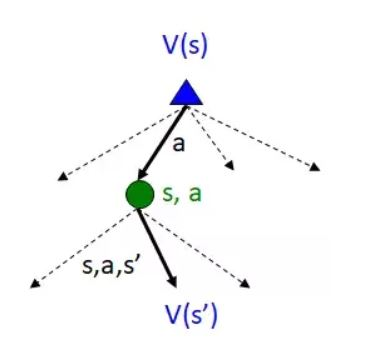
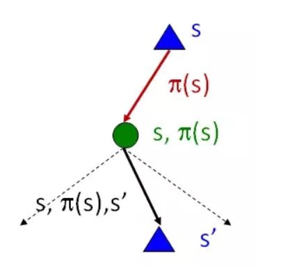

**值迭代 ** 和 **策略迭代** 都是围绕贝尔曼方程, 通过贝尔曼更新式来找到针对问题的最优策略，只是在实作上有所不同。

贝尔曼方程：

$$V^*(s) = \max\sum_{s'}T(s,a,s')[R(s,a,s')+\gamma V^*(s')]$$

他们的不同之处在于：

* 值迭代简单，但是计算量很大；

* 策略迭代复杂一些，但是更高效，因为大多数情形是，策略会在值函数收敛之前收敛；

* 值迭代的步骤是：**找到最优的值函数** + **仅一次**策略提取（例如贪婪策咯）；找到最优的值函数就是  

  不停地迭代值函数直至收敛（例如变化小于$$\delta$$）；

  

* 策略迭代的步骤是： **策略评估** 和 **策略改善** 交替进行， 直至策略不变（收敛） ，

  策略评估就是在当前策略$$\pi_{i}$$下的值迭代，更新式如下：

  $$V^{\pi_{i}}_{k+1}(s) \leftarrow \sum_{s'}T(s,\pi_{i}(s), s')[R(s,\pi_{i}(s),s')+\gamma V_{k}^{\pi_{i}}(s')]$$ 

  策略改善就是，根据当前的值函数确定一个新的策略，（one-step look-ahead）跟新式如下：

  $$\pi_{i+1}(s)=\arg\max_{a} \sum_{s'}T(s,a,s')[R(s,a,s')+\gamma V^{\pi_{i}}(s')]$$

  

  ​

