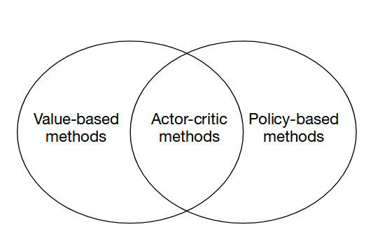
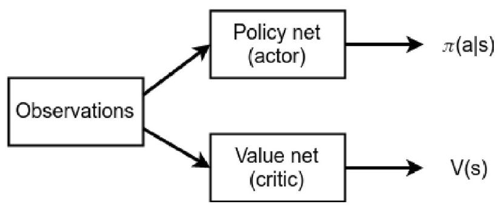
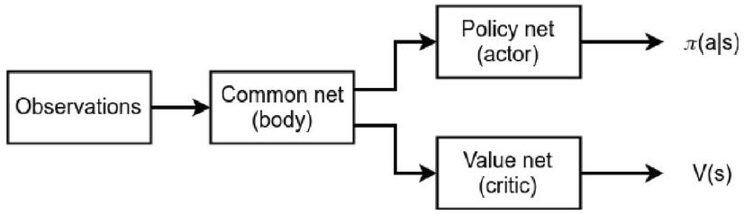

## Actor-critic

减小方差策略梯度的方差,可以通过减掉一项baseline来达成, 这一项baseline可以是

一个episode中reward的均值, 其实更普遍地将, baseline这一项只要是状态相关的项

即可, 之所以是状态相关,为的是评价一个状态的好坏.

如果我们把一个状态下采取某个动作的好坏,看作两部分的叠加, 第一部分为一个状态

的好坏, 第二部分为在这个状态采用某个的哦你工作的好坏.

$$Q(s,a)=V(s)+A(s,a)$$  

如果吧$$V(s)$$ 这一项当作baseline, 则agent的policy gradient的系数就仅仅依赖$$A(s,a)$$了.

那么问题来了, $$V(s)$$的值我们并不知道, 既然不知道就用一个neural network来估计每一个

观测的$$s$$的$$V(s)$$吧!  其中$$A(s,a)$$这一项被称作是Advantage function.

$V(s)$的更新是遵从bellman update的.(We'll carry out the Bellman step and then minimize

the mean square error to improve $$V(s)$$ approximation)   

所以类 actor-critic 方法可以看作是 value-based方法 和 policy-based方法的结合.

***

当我们知道了每一个状态的$$V(s)$$时, 我们就可以计算策略网络(policy network)的梯度,用以  

增加某个动作的概率(当某个动作的advantage function的值为正时)或是降低某个动作的概率  

(当某个动作的advantage function的值为负时).   

现在的网络有两个, 一个用来输出动作的概率, 这个叫做策略网络(policy network),也可以  

称为actor, 它告诉我们应该输出什么动作, 另一个网络用来称为critic, 它告诉我们这个动作

有多好(多坏).

命名 Actor-Critic = Advantage Actor-Critic = A2C

**A2C(Advantage Actor Critic)**的框架如下图所示:

实作的话, 一般两个网络会有公共部分, 主要是从计算的效率和收敛速度上来考虑的做法,

例如在玩atari的时候共享底层的卷积特征.   

结构如下:

从训练的角度来看, 完整的流程如下:

>1 **Initialize network parameters $$\theta$$ with random values**   
>
>2 **Play $$N$$ steps in the environment using the current policy $$\pi_{\theta}$$,**
>
>   **saving state $$s_{t}$$ , action $$a_{t}$$ ,  reward $$r_{t}$$**   
>
>3 **$$R=0$$ or $$V_{\theta}(s_{t})=0$$  if the end of the episode is reached**
>
>4 **For $$i=t-1...t_{start}$$ (note that steps are processed backwards):**
>
>* **Accumulate the PG** $$\partial\theta_{\pi} \leftarrow \partial\theta_{\pi}+\nabla_{\theta}\log\pi_{\theta}(a_{i}|s_{i})(R-V_{\theta}(s_{i}))$$  
>* **Accumulate the value gradients $$\partial\theta_{v}\leftarrow \partial\theta_{v}+\frac{\partial(R-V_{\theta}(s_{i}))^2}{\partial\theta_{v}}​$$**  
>
>5 **Update network parameters using the accumulated gradients, moving**  
>
>   **direction of PG $$\partial\theta_{\pi}$$ (最大化)and in the opposite direction**  
>
>   **of the value gradient $$\partial\theta_{v}$$(最小化)**
>
>6 **Repeat from step 2 until convergence is reached**

但是实际应用中还会加上一些其他技巧:

* Entropy bonus is usually added to improve exploration. So Gradients accumulation

  is usually implemented as a loss function combining all three components: policy loss,  

  value loss, and entropy loss. Careful the signs of these losses :smile:.

  add entropy value:   

  $$L_{entropy} = \beta \sum_{i}\pi_{\theta}(s_{i})\log\pi_{\theta}(s_{i})$$.

* To improve stability, it's worth using several environments, our training batch wil be  

  created from their observations. **这就是开多个环境一起跑的方法, 被称作Advantage   **

  **Asynchronous Actor-Critic, 简称A3C**.

