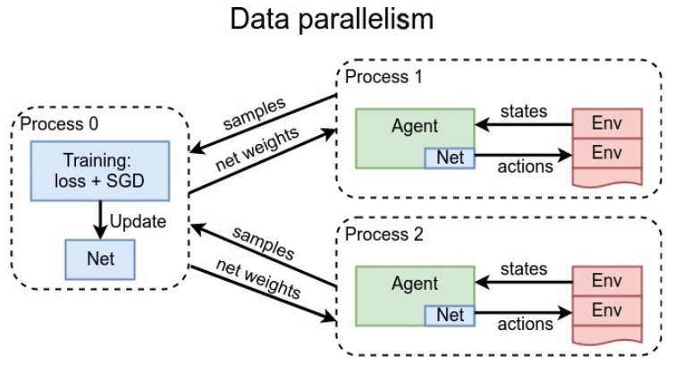
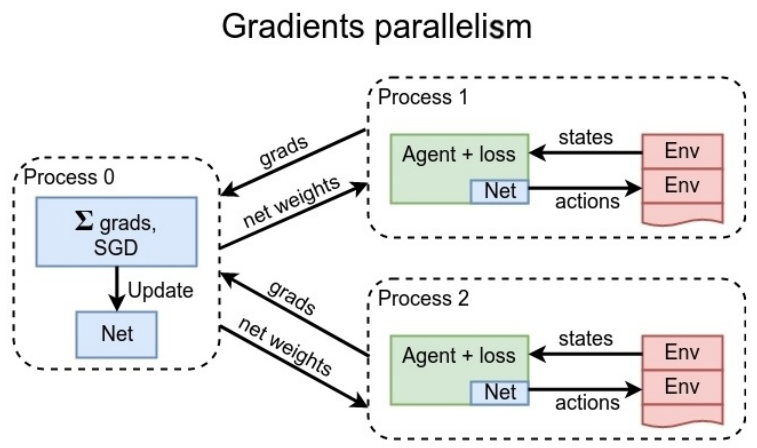
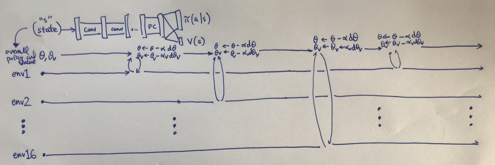

对于actor-critic方法的并行化, 主要有两种方式:

* 数据并行: 我们可以同时开多个进程(环境env), 用agent和每一个环境进行交互, 产生交

  互数据transitions $$(s,r,a,s')$$. 这些数据被合并起来, 被输入到一个单独的训练进程0, 这  

  个训练进程会计算loss以及进行weights的更新. 更新后的网络的参数(weights),将被派发到

  与环境交互的多个进程中,相当于(on-policy), 新的agent将于环境继续互动,以产生新的

  数据.

* 梯度并行: 开多个进程与不同的环境进行交互, 每一个进程都进行梯度计算, 进程0,将各个

  进程的梯度加起来统一交给进程0,来进行weights的更新, 更新后的agent将被分发到与每

  一个环境交互的进程.(So it's also on-policy method)

图示:

选哪种呢?看你的硬件配置(说了和没说一个样:cry:), 实作的话,第一种简单一些:smile:.

***

**A2C 和 A3C 的区别?**

都是利用多个环境产生数据, 区别在于更新参数(update agent's weights)时, 是同步地更新还是异步地

更新, 如果是异步(**Asynchronous**)的则是A3C, 同步的就为A2C . :smile: 

The updates are done in crazy! Since it assumes that different threads reached their  

"update point" at different times and update separately. 当然会出现线程安全的问题(多个

线程同时想要更新参数), 但是即便发生了,对大局也产生不了什么影响, 因为迭代一般需要数百万次  

甚至更多.

### reference

[https://danieltakeshi.github.io/2018/06/28/a2c-a3c/](https://danieltakeshi.github.io/2018/06/28/a2c-a3c/)

