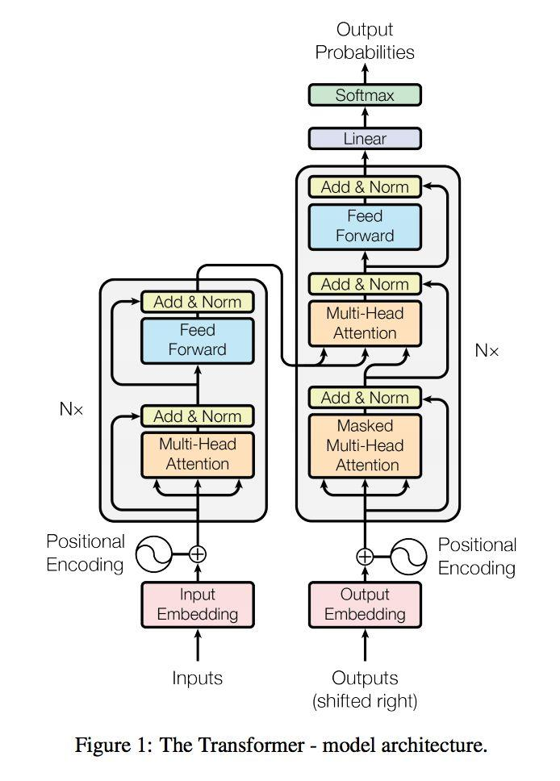
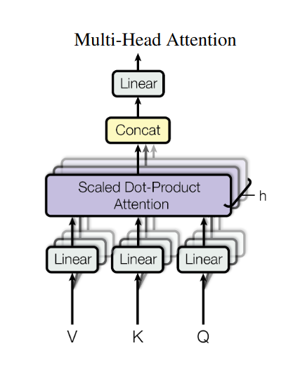

#### 整体结构

Transformer 源自"Attention is all you need"一文.

主要的模型结构如下:



整体来看就是encoder-decoder的结构, 只不过没有使用RNN这种模块, 取而代之的是self-attention和dense的组合模块. 其中在encoder端堆叠了6个该模块, decoder端堆叠了6个 mask-attention(context attention), self-attention, dense的组合模块.

 dense(文中称为**Position-wise Feed-Forward network**)的公式为 

$$FFN(x) = relu(xW_{1}+b_{1})W_{2}+b_{2}$$

#### 分解模块

* Attention module

  在文章中有三处出现了attention, encoder和decoder中的self-attention; decoder中的context attention.

* Multi-head 机制

  

​         该操作就是将一个长的feature均匀的分为n段分别来做scaled Dot-Product Attention. 

* Add & Norm

  Add 实际上是一个residual连接, Norm在这里采用的是Layer Normalization(不同与Batch Normalization).

* Mask 

  文中的Mask 分为两种, 一种是Padding mask, 另一种是Sequence mask. 

  Padding mask是用来补齐数据的(因为句子的长度不一相同, 短的句子需要用0补齐);

  Sequence mask是为了使的decoder不能看见未来的信息, 即在time_step为t的时刻, 解码输出只能依赖于t时刻之前的输出.

* Positional encoding

  将位置信息编码的模块, 文中将位置信息编码成长度为512的向量,

  公式为:

  $$PE(pos, 2i) = sin(pos/10000^{2i/d_{model}})$$  

  $$PE(pos,2i+1)=cos(pos/10000^{2i/d_{model}})$$  

  代码如下:

  ```python
  import numpy as np
  d_model = 512
  max_seq_len = 100
  
  position_encoding = np.array([[pos / np.pow(10000, 2.0*(j//2)/d_model) for j in     	range(d_model)] for pos in range(max_seq_len)])
  
  position_encoding[:, 0::2] = np.sin(position_encoding[:, 0::2])
  position_encoding[:, 1::2] = np.cos(position_encoding[:, 1::2])
  ```

* Word Embedding

  略


更具体的细节可以阅读[https://github.com/jadore801120/attention-is-all-you-need-pytorch](https://github.com/jadore801120/attention-is-all-you-need-pytorch).