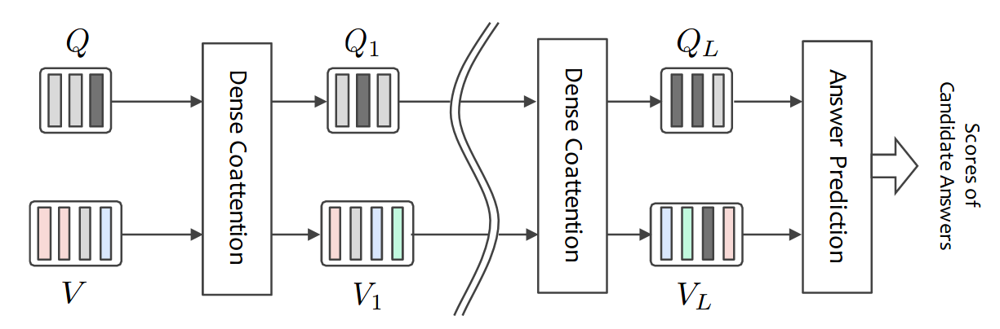
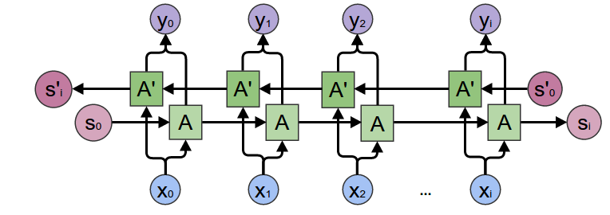
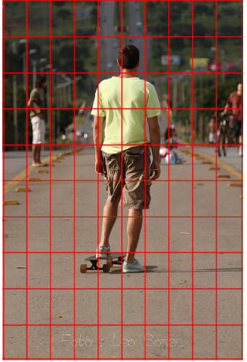
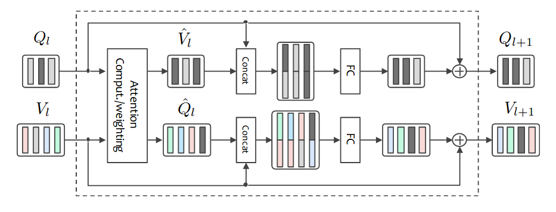
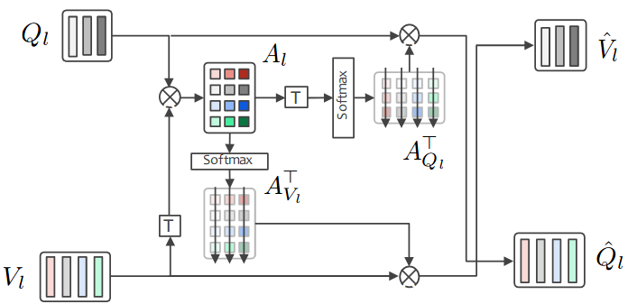
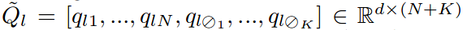
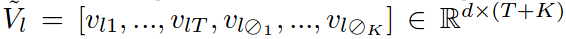
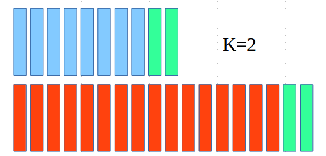
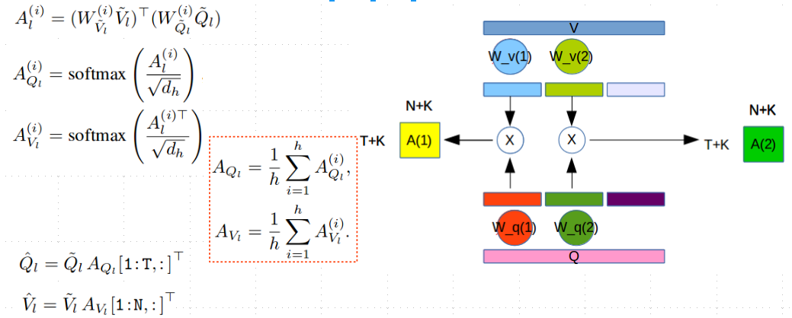
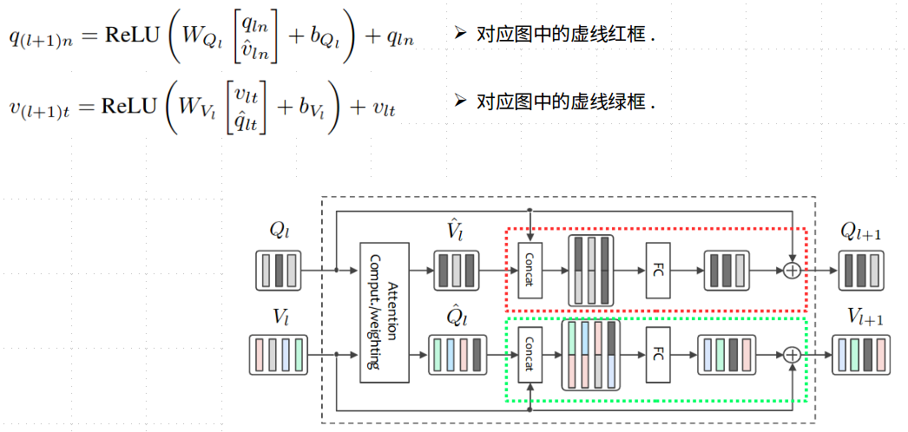

最近的业余时间都沉溺于练琴, 很久没有写自己的部落格了,深感惭愧. 还是分享一篇很有意思的文章吧.

这篇文章是关于VQA(Visual Question Answering )的. 结果虽然不怎么样, 但是提出了很多风骚的技巧.

### 1. overview

* 采用Co-Attention机制对图片与问句信息进行交互融合

* 采用级联的方式对图片和问句的信息进行多次更新

  整体框架如下:

  

### 2. main content

* 特征提取
* Dense Co-Attention Layer
* 回答预测(分类)

#### 2.1 feature extraction

 问句和答案的信息都采用, bi-directional LSTM(concatenate) 进行编码

$$\vec{q_{n}} = Bi\_LSTM(\vec{q_{n-1}}, e_{n}^Q)$$ 

$$\overleftarrow{q_{n}} = Bi\_LSTM(\overleftarrow{q_{n+1}}, e_{n}^{Q})$$ 

$$q_{n} = [\vec{q_{n}}^{T}, \overleftarrow{q_{n}}^{T}]^T (n=1,...,N)$$ 

$$S_{Q} = [\vec{q_{N}}^{T}, \overleftarrow{q_{1}}^{T}]^T$$  提取问题特征时需要用到.

  

#### 2.2 image feature extraction

图片采用的是Grid特征, 将每一个grid送入预训练好的ResNet-152, 取其中4个conv-layers的输出, 对应的尺寸
分别为(256x112x112, 512x56x56, 1024x28x28, 2048x14x14). 

* 采用不同的max pooling尺寸和卷积层将4种尺寸的特征,转换为统一的d x T, 其中T = 14x14.
* 为4种特征做加权. 使用一个两层的全连接层, 隐层节点724,激励为Relu,输出节点为4. 对输出结点[s1, s2, s3, s4]做softmax. 得到加权的权重.
* $$[s_1, s_2, s_3, s_4] = MLP(s_Q)$$ 
* 

#### 2.3 Dense Co-Attention Layer

* 输入: $$Q_{l} = [q_{l1},...,q_{lN}] \in \R^{d\times N}$$, $$V_{l} = [v_{l1},...,v_{lT}] \in \R^{d\times T}$$  

* 输出: $$Q_{l+1} \in \R^{d\times N}$$, $$V_{l+1} \in \R^{d\times N}$$   

  结构如下: 

##### 2.3.1 Dense Co-attention Mechanism

计算相关矩阵等常规操作:

$${A_{l}} = V_{l}^{T}W_{l}Q_{l}$$

$$A_{Q_{l}}=softmax(A_{l})$$

$$A_{V_{l}}=softmax(A_{l}^{T})$$

$$\hat{Q_{l}} = Q_{l}A_{Q_{l}}^{T}$$ 

$$\hat{V_{l}} = V_{l}A_{V_{l}}^{T}$$

#### 2.4 Nowhere-to-attend and memory

* 对于解答某一个问题, 如果没有图像框值得去注意(依靠常识或者猜测就可以回答?), 可以通过加入一些可训练的参数作为额外信息的来源. 
* 具体做法如下: 在图像特征和文句特征上增加K个words或是regions(可训练参数).

#### 2.5 Parallel attention (multi-head)

这是我们实验过有效的一种技巧, 在特征维度d上做切分, 假设head数为h. $$d_{h} = d/h$$

#### 2.6 Fusing Image and Question Representations

### 3. Answer Prediction

提供一中将问题编码进分类器的方法:

假设有一个答案有M个词, word embedding为 $${e_{1}^{A},...,e_{M}^{A}}$$ 

经过Bi-LSTM后得到 $$S_A = [\vec{a_{M}}^{T}, \overleftarrow{a_{1}^{T}}]^T$$ 

$$logits = \sigma(S_{A}^{T}W(S_{Q_{L}}+S_{V_{L}}))$$ 

### 总结:

提出了层级递进的Dense Co-Attention的结构。

提供了很多针对Co-Attention结构进行改进的操作。