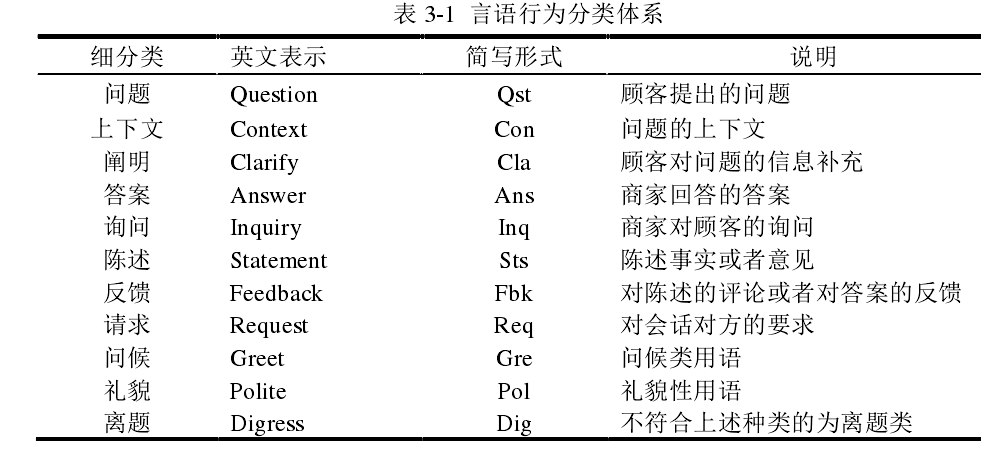
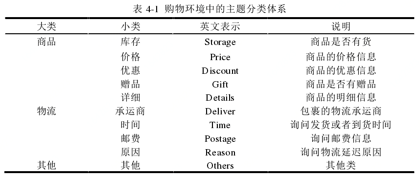
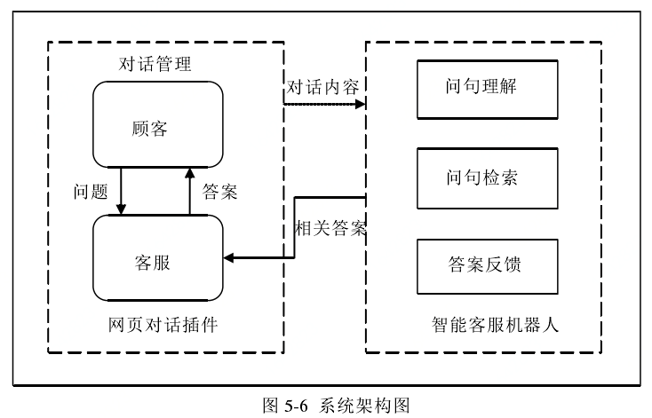

### 1. 问答系统

传统问答系统：问题分析、信息检索、答案抽取。可以理解为是一种单轮的对话系统，如下图所示：

### 2.问句理解

**网络购物的语言特点**：1. 短词优先；2.短句偏好性；3.语句不规范；4.主题跳跃；5.口语化

**会话本身的固有特点**：1.知识共有；2.知识缺省；3.上下文关联

**隐含的问题集的处理**：1.识别隐含问点；2.整个问句的理解（将问句解析成一个机构化的特征向量）

### 3.言语行为及问点提取

#### 3.1 语言行为

例如下图是一个设计的购物对话中的言语行为的分类：

* 是否包含疑问词
* 是否包含问句特征（例如？）
* 与前句的语义相似度
* 句子的位置
* 句子中所含的词（“好的”，“哦”，“请问”）
* 句子的长度（一般问句和答案的长度较长）
* 句子中是否出现动词
* 句子间是否存在指代
* 句子的复杂度

既然有类别，那么对语言行为的识别就是一个分类问题， 可以利用分类模型对问题进行求解，例如贝叶斯费雷或是条件随机场CRF或是NN等等，非深度学习的方法的关键在于特征的选择。

#### 3.2 问点提取

问点提取是说，当前这句该不该进行“回答”？？？

需要继续看看......

### 4. 问句主题识别和语义约束提取

#### 4.1 问句主题

主题识别本质还是一个分类问题，可以设计成一个层次分类，大类与小类，如下图所示:

特征选择：

* 主题相关词：如邮费、付款、赠品、快递公司etc.
* 词性特征：如在涉及价格和邮费主题时，数词和量词出现的较多
* 句式特征：特定的主题一般有常见的句式，如： topic:物流时间，请问......什么时候到？
* 命名实体：购物会话中包含的命名实体一般比较少，一般为地名，商品名，偶尔出现人名。

#### 4.2 问句语义/语义块

语义块：代表句子中不依赖于其它词汇而能表示某种普遍的语义的最小部分。

例如：“书包红色的 包邮吗”  “书包”，“红色的”，“包邮吗”形成了3个语义块。

语义块的识别有很多方法，例如用，同义词林，模式匹配，句法分析器，或字典匹配分词等，ner也可以。

### 5. 问句理解评价与系统搭建

评价用F1值

系统如下如所示：

所以本质还是一个检索式的多轮对话系统。

